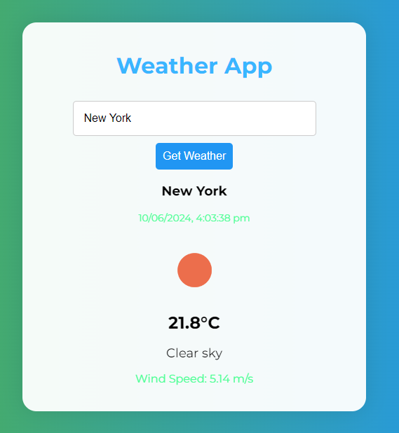

# Weather App

## Description

The Weather App is a simple web application that provides real-time weather information for any city around the world. Users can enter a city name, and the app fetches and displays current weather details, including temperature, weather conditions, wind speed, and an icon representing the current weather.

## Features

- **Search for Cities**: Enter the name of any city to get the current weather.
- **Real-time Data**: The app fetches weather data from the OpenWeather API.
- **User-friendly Interface**: Designed with a clean and modern layout.
- **Responsive Design**: Works well on both desktop and mobile devices.

## Technologies Used

- **HTML**: Structure of the web application.
- **CSS**: Styling and layout.
- **JavaScript**: Functionality and interactivity.
- **OpenWeather API**: Fetching weather data.

## Setup

1. **Obtain an API Key**:
   - Sign up at [OpenWeather](https://openweathermap.org/) and obtain your API key.
   - Replace `"OPEN_WEATHER_API_KEY"` in `script.js` with your actual API key to enable the app to fetch weather data.

2. **Open the `index.html` file**:
   - You can simply open the `index.html` file in your web browser to view the app.

## Usage

- Enter a city name in the input field and click the "Get Weather" button.
- The app will display the weather information for the entered city.

## Example

 